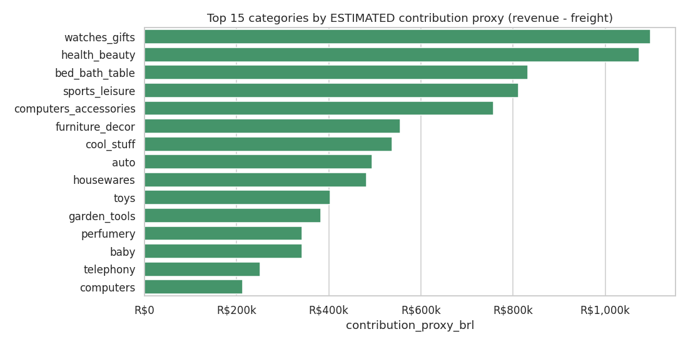
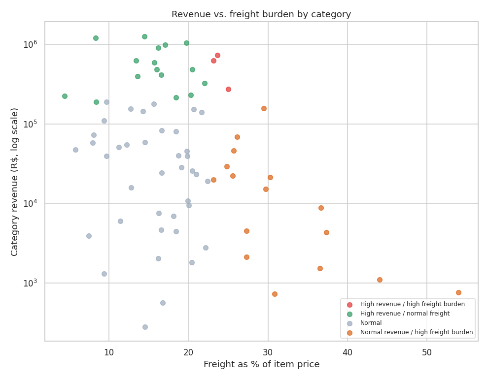

# Revenue & Profitability Analysis (ESTIMATED)

> **The Olist dataset has no product cost, commission, or profit field.** Every "profitability" figure below is either actual revenue/freight, or a clearly labelled **ESTIMATED contribution proxy**. See `docs/methodology.md` for the full definition. Full query output: `sql/07_profitability_analysis.sql` / `reports/sql_results/07_profitability_analysis__*.csv`. Charts: `reports/figures/`.

## Revenue composition
| Metric | Value |
|---|---:|
| Product revenue (GMV) | R$ 13,494,400.74 |
| Freight revenue | R$ 2,241,126.29 |
| Total order value | R$ 15,735,527.03 |
| Freight as % of order value | 14.24% |
| Total cash paid (payments) | R$ 15,738,221.95 (differs from order value by 0.02%) |

## ESTIMATED contribution proxy by category
Proxy = `revenue - freight`, i.e. freight stands in for the main variable cost per order (documented assumption, not a fact from the data). 

Health & beauty, watches/gifts and bed/bath/table lead on both revenue and this proxy, since their freight burden is low relative to price.

## Revenue vs. freight-burden quadrant

**High revenue AND high freight burden** (top quartile on both): `furniture_decor`, `housewares`, `office_furniture`. These generate real revenue but a large share is absorbed by shipping cost - the categories most worth investigating for freight optimisation (regional warehousing, bulkier-item surcharges, or carrier renegotiation).

## Contribution proxy by region
The Southeast has the strongest estimated contribution margin (84.8%), the North the weakest (77.3%) - consistent with the longer delivery distances and higher freight-to-price ratio already seen in the operations analysis.

## Contribution proxy by customer segment
'Potential Loyalists' and 'At-Risk Customers' together hold about 73% of estimated contribution, reinforcing the segmentation finding in `reports/business_recommendations.md`: converting first-time buyers and winning back high-value inactive customers are the two most valuable levers available.

## Explicit limitation
This proxy excludes product cost, Olist's commission, payment-processing fees, returns/refunds and fixed overhead. It should be read only as a **directional** view of which categories/regions/segments carry more shipping cost relative to revenue - never as a statement of true profit margin.
